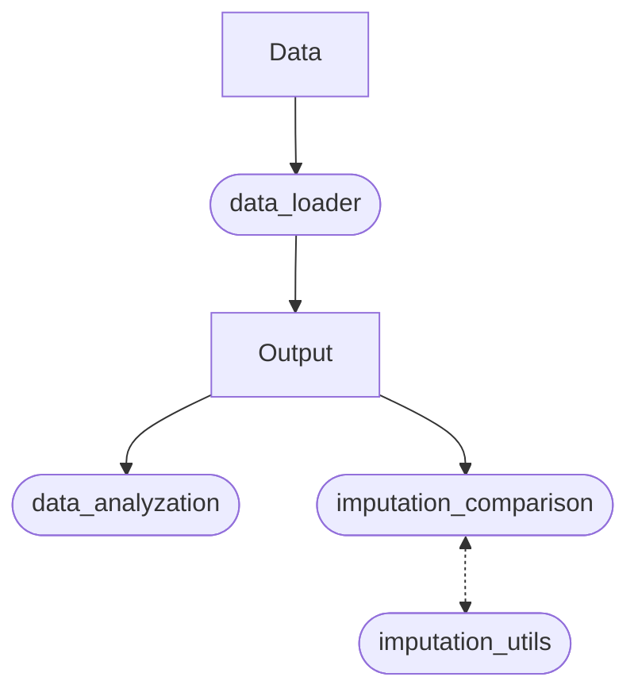

# Sensor-Based Modeling of Fatigue Using Transformer Model
## Abstract
Fatigue is a common symptom of many chronic diseases, lowers productivity, and is a main culprit in driving accidents. Yet up to date, the main method to monitor fatigue is through questionnaires, which are not only slow and costly but suffer from subjective biases. In this work, we explored the feasibility of automated fatigue monitoring using machine learning (ML). Our models achieved a weighted F1-score of 0.75 ± 0.02 for physical and 0.66 ± 0.04 for mental fatigue on stratified group 5-fold cross-validation (CV). Using a convolutional neural network (CNN), our approach reached an F1-score of 0.68 ± 0.24 and a balanced accuracy of 0.67 ± 0.19 for physical fatigue on leave-one-subject-out (LOSO) CV. Additionally, we explored different missing data imputation
methods for physiological data from wearables and demonstrated the feasibility of using a transformer model for imputation. The transformer model outperformed all other
imputation techniques (e.g. linear interpolation, nearest neighbour) and
showed high stability for different time-series data. Lastly, we showed the advantages of hybrid imputation strategies that use different imputation methods based on physiological variables and missing data length. These results open up new opportunities to leverage machine learning and sensor data to automatically measure fatigue. Additionally, they show the capability of transformer models to impute missing data in physiological signals.

## Overview repository
- **Data**: This folder contains the used dataset in raw form 
- **Models**: This folder contains the trained transformer models 
    - _transformer_imputation_final_: This model is trained on the full dataset for 2000 epochs and used for imputation.
    - _transformer_imputation6500_: This model is trained on the provided training set for 6500 epochs and is used to compare against other imputation methods.
- **Output**: This folder contains:
  - A) Dataset:
    - _combined_data.csv_: This is the used dataset in (X, Y) form (X: physiological variables, y: binary labels)
    - _combined_data_mean.csv_: The is the used dataset with daily mean physiological data
    - _combined_data_unnested.csv_: This is the used dataset with each row being a separate measurement 
  - B) Spectrograms (linear interpolation):
      - _feature_vector#.npy_: An individual spectrogram 
      - _labels#.npy_: Binary labels (PhF, MF) for a spectrogam
      - _metadata.txt_: Additional information (subjectID, etc.)
  - C) Statistical feature set:
    - _feature_vector_stat#.npy_: An individual statistical feature vector
    - _labels_stat#.npy_: Binary labels (PhF, MF) 
    - _metadata_stat.txt_: Additional information (subjectID, etc.)
  - D) Other feature sets:
    - **transformer_imputation**: Spectrograms using transformer imputation
    - **full_transformer_imputation**: Spectrograms with full transformer output (not just imputation)
    - **stat_imputation**: Statistical feature vectors using linear interpolation
    - **stat_transformer_imputation**: Statistical feature vectors using transformer imputation
- **Scores**: This folder contains the classification scores for each CV 
- `CNN.ipynb`: CNN model
- `data_analyzation.R`: Statistical analysis of dataset
- `evaluator.py`: Utility functions used for evaluation
- `data_loader.ipynb`: This notebook loads the dataset from its raw form (in **Data**) to used dataset (in **Output**)
- `imputation_comparison.ipynb`: This notebook is used to compare the different imputation methods
- `imputation_transformer.ipynb`: This notebook trains the transformer on the full dataset
- `imputation_utils.py`: Utility functions for `imputation_comparison.iypnb` and `imputation_transformer.ipynb`
- `majority_voting.ipynb`: Biased random guess baseline
- `preproc_data.ipynb`: Preprocessing pipeline for spectrograms (with segmentation)
- `preproc_data_no_segments.ipynb`: Preprocessing pipeline for spectrograms (without segmentation)
- `preproc_data_stat.ipynb`: Preprocessing pipeline for statistical features
- `random_forest.ipynb`: Random forest model
- `random_guess.ipynb`: Random guess baseline
- `xgboost.ipynb`: XGBoost model

## Data pipeline
### a) Classification

### b) Statistical analysis & imputation comparison

