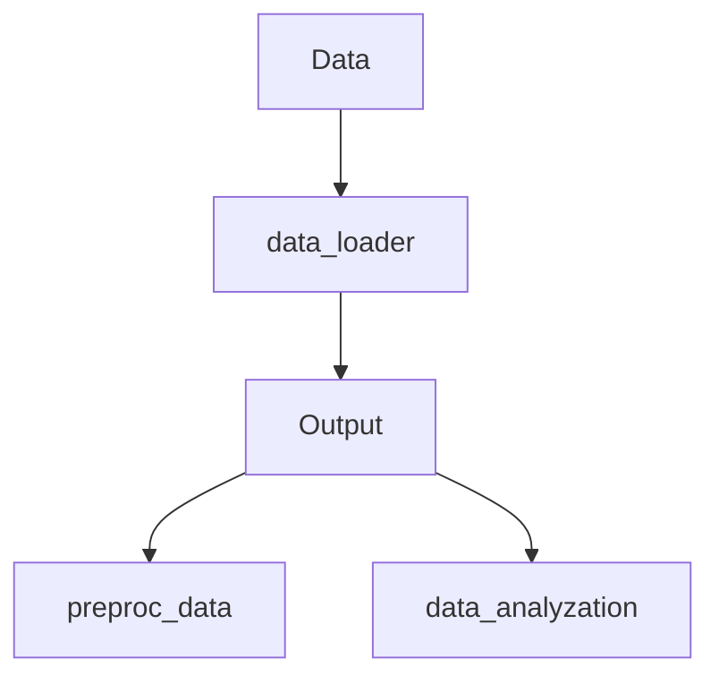

# Sensor-Based Modeling of Fatigue Using Transformer Model

# Data flowchart

# TODO:
- Preproc: impute (all) -> spectrogram -> segment -> filter
- Imputation: try last observation carried forward/backward (+ local poly.?)
- Imputation: ActivityClass is categorical -> linear interpolation poor
- Analysis: ~~check missing data ration for each variable (-> discard)~~ + check segmentation ratio
- Filter: flag, impute then filter out
- (Feature vector: incl. whether data artificial or not?)
- Model: majority voting (+ accuracy, recall etc.)
- Spectrogram: check if full imputation resolves small image sizes
- Spectrogram: black/white bars? (e.g. 0, HR)
- Segmentation: forward window but end may be missed?
- Variable: ActivityClass categorical (-> no spectrogram nor linear interpolation) + lots of missing data -> discard?

# Notes
- normalize subject data (Z-score) to combat intra-subject variability? (~ calibration)