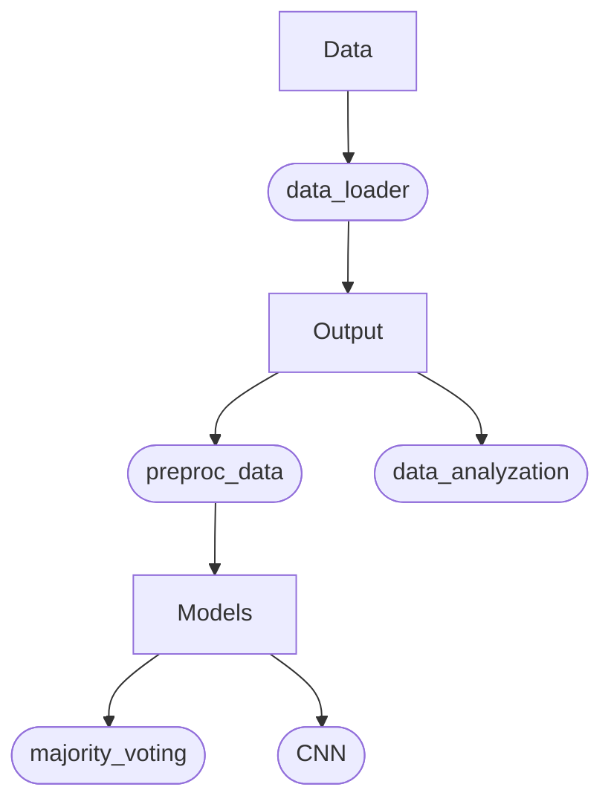

# Sensor-Based Modeling of Fatigue Using Transformer Model

# Data flowchart

# Currently:
### MobileNet
- MobileNet spectrogram? (-> not trained specifically on spectrograms?)
- MobileNetV2 doesn't expect 30 input channels (-> multiple input nets)
- MobileNetV2 input spectrograms usually much clearer (-> image processing?)
- Other pretrained models?

### Custom CNN
- Smaller models (-> 400k params for 4k data is a lot)
- Combat overfitting
- Weighted loss function
- Multi-head classification (phF + MF)
- image processing?

### Upsampling
- SMOTE (-> meaningful for image data? we lose local correlation)
- RUS (-> downsampling leads to smaller dataset)
- Just upsampling (-> overfitting)
- Upsampling + data augmentation (-> augmentations different enough to avoid overfitting?)
- Weighted loss function

### Additional
- LOSO for general models (-> group (stratified) k-fold)
- Artificial data mask as input
- Data augmentation scaling

# Notes
- normalize subject data (Z-score) to combat intra-subject variability? (~ calibration)
- Feature vector: incl. whether data artificial or not?
- Better imputation strategy