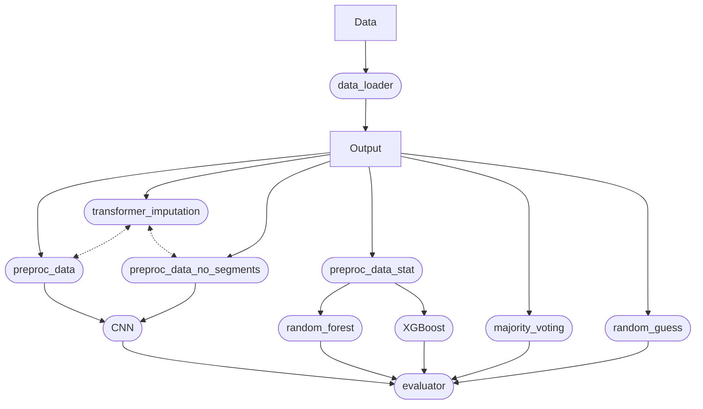

# Sensor-Based Modeling of Fatigue Using Transformer Model

# Data pipeline

```mermaid
flowchart TD;
    Data --> id1([data_loader])
    id1([data_loader]) --> Output
    
    Output --> id2([preproc_data])
    Output --> id14([transformer_imputation])
    Output --> id13([preproc_data_no_segments])
    Output --> id6([preproc_data_stat])
    Output ---> id4([majority_voting])
    Output ---> id9([random_guess])

    id6([preproc_data_stat]) --> id8([random_forest])
    id6([preproc_data_stat]) --> id10([XGBoost])
    id13([preproc_data_no_segments]) --> id5([CNN])
    id2([preproc_data]) --> id5([CNN])
    
    id14([transformer_imputation]) <.-> id2([preproc_data])
    id14([transformer_imputation]) <.-> id13([preproc_data_no_segments])
    
    id5([CNN]) --> id11([evaluator])
    id4([majority_voting]) --> id11([evaluator])
    id8([random_forest]) --> id11([evaluator])
    id10([XGBoost]) --> id11([evaluator])
    id9([random_guess]) --> id11([evaluator])
```

# Data analyzation & utilities

```mermaid
flowchart TD;
    Data --> id1([data_loader])
    id1([data_loader]) --> Output
    
    Output --> id3([data_analyzation])
    Output --> id12([imputation_comparison])
    
    id12([imputation_comparison]) <.-> id4([imputation_utils])

```