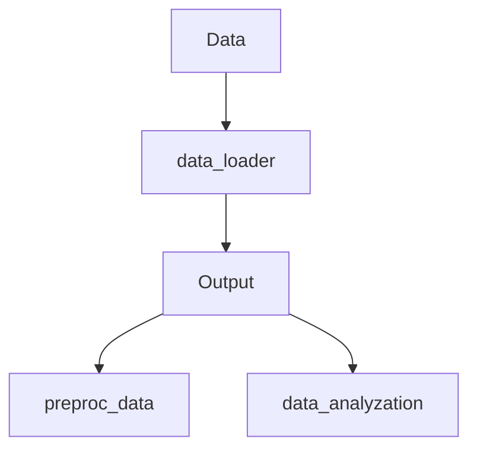

# Sensor-Based Modeling of Fatigue Using Transformer Model

# Data flowchart

```mermaid
graph TD;
    Data --> data_loader; 
    data_loader --> Output;
    Output --> preproc_data;
    Output --> data_analyzation;   
```